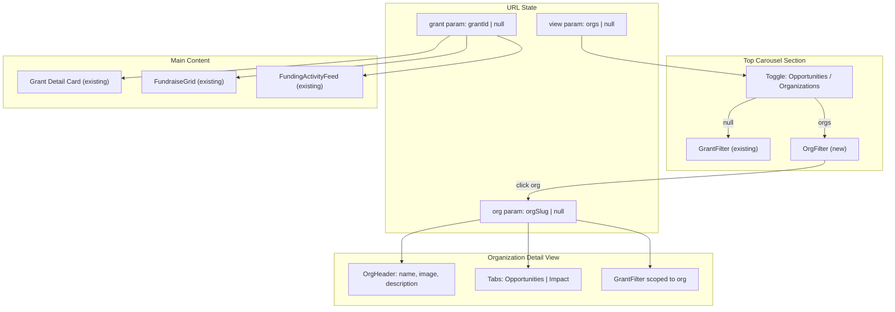

# Organization Browse UX for Funding Explore

## Current Architecture

The page at [`app/fund/explore/page.tsx`](app/fund/explore/page.tsx) has a single browse dimension: **grants** (funding opportunities). The top carousel (`GrantFilter`) lets users select a grant, which filters the fundraise grid and activity feed below. State is managed via the `?grant=<id>` URL param.

## Proposed Architecture

We introduce a second browse dimension: **organizations** (funders). The top section becomes a dual-mode carousel with a toggle, and selecting an organization scopes everything to that org's grants/fundraises.

### URL State Design

```
/fund/explore                         → Default: browse opportunities
/fund/explore?view=orgs               → Browse organizations
/fund/explore?org=<orgSlug>           → Organization page (shows org header + its grants)
/fund/explore?org=<orgSlug>&grant=<id> → Org page with a specific grant selected
```

The `view` param controls the carousel mode. The `org` param activates the organization detail view. The existing `grant` param continues to work within an org context.

### Data Flow



### UI Layout -- Two Modes

**Mode 1: Default Browse (no `org` param)**

- Toggle at top: `[Opportunities] [Organizations]`
- If toggle = Opportunities: existing `GrantFilter` carousel
- If toggle = Organizations: new `OrgFilter` carousel showing org cards
- Below: existing grant detail card, fundraise grid, activity feed

**Mode 2: Organization Page (`org` param set)**

- **Organization Header** (new): large banner with org image/logo, org name, brief description, total funding amount
- **Tab bar**: `[Opportunities] [Impact]` -- Impact tab is placeholder only
- **GrantFilter** scoped to that org's grants only
- Below: same grant detail, fundraise grid, activity feed -- all scoped to the selected org's data

### Entry Points to Organization View

1. **From OrgFilter carousel**: clicking an org card sets `?org=<orgSlug>`
2. **From GrantFilter cards**: the organization name label on each grant card becomes clickable, navigating to `?org=<orgSlug>`
3. **From FundraiseCard** (optional): if org info is displayed on cards

---

## Files to Create / Modify

### 1. New: Mock organization data in `mocks/fundingExploreMocks.ts`

- Add a `mockOrganizations` array derived from unique `grant.organization` values
- Each org object: `{ slug, name, imageUrl, description, totalFunding, grantCount }`
- Add helper: `getGrantsByOrganization(orgSlug)` and `getFundraisesByOrganization(orgSlug)`

### 2. New: `FundingOrganization` type in `types/fundingOrganization.ts`

```typescript
export interface FundingOrganization {
  slug: string;
  name: string;
  imageUrl?: string;
  description: string;
  totalFunding: { usd: number; rsc: number; formatted: string };
  grantCount: number;
}
```

### 3. New: `OrgFilter` component in `components/Fund/explore/OrgFilter.tsx`

- Mirrors `GrantFilter` structure: uses `Carousel` with org cards
- Cards show: org image/logo, org name, grant count, total funding
- `onSelectOrg(orgSlug)` callback

### 4. New: `OrgHeader` component in `components/Fund/explore/OrgHeader.tsx`

- Displays at the top when in org detail mode
- Shows org image/logo (large), org name, description, total funding
- Back button/breadcrumb to return to browse mode

### 5. New: `BrowseToggle` component in `components/Fund/explore/BrowseToggle.tsx`

- Simple pill/tab toggle: `Opportunities | Organizations`
- Controls the `view` URL param

### 6. Modify: `components/Fund/explore/GrantFilter.tsx`

- Make the organization label on each grant card clickable
- Add `onClickOrganization?(orgSlug: string)` optional callback prop
- When clicked, navigates to org view instead of selecting the grant

### 7. Modify: `app/fund/explore/page.tsx` (main orchestration)

This is the primary change. The page gains:

- `view` and `org` URL param reading
- Conditional rendering based on mode:
  - **No org**: show `BrowseToggle` + either `GrantFilter` or `OrgFilter`
  - **With org**: show `OrgHeader` + tab bar (Opportunities / Impact) + scoped `GrantFilter` + scoped content
- All existing filtering logic extended to scope by org when `org` param is set
- The `handleGrantSelect` function updated to preserve `org` param

### 8. Modify: `components/Fund/explore/index.ts`

- Export new components: `OrgFilter`, `OrgHeader`, `BrowseToggle`

---

## Organization Page Tab Bar

When viewing an organization (`org` param set), a tab bar appears below the org header:

- **Opportunities** (default): shows the org's grants and proposals -- identical UX to current page
- **Impact** (placeholder): renders a simple "Coming soon" placeholder div. Implementation deferred.

The active tab is stored as local state (not URL) since it's view-only and the Impact tab has no content yet.

---

## Key Design Decisions

- **URL-driven state**: all navigation state lives in URL params for shareability and back-button support
- **Reuse existing components**: `GrantFilter`, `FundraiseGrid`, `FundraiseGridHeader`, `FundingActivityFeed` all work unchanged -- they just receive org-scoped data
- **Organization slug**: derived from org name (e.g., "ResearchHub Foundation" -> "researchhub-foundation") for clean URLs
- **No new pages**: everything lives on `/fund/explore` with URL params controlling the view

---

## Implementation Todos

| #   | Task                                                                                                                 | Status  |
| --- | -------------------------------------------------------------------------------------------------------------------- | ------- |
| 1   | Create `FundingOrganization` type in `types/fundingOrganization.ts`                                                  | pending |
| 2   | Add `mockOrganizations` and helper functions to `mocks/fundingExploreMocks.ts`                                       | pending |
| 3   | Create `BrowseToggle` component (Opportunities / Organizations pill toggle)                                          | pending |
| 4   | Create `OrgFilter` carousel component mirroring `GrantFilter` pattern                                                | pending |
| 5   | Create `OrgHeader` banner component for organization detail view                                                     | pending |
| 6   | Make organization label in `GrantFilter` clickable with `onClickOrganization` callback                               | pending |
| 7   | Update `page.tsx`: add view/org URL params, conditional rendering, org-scoped data filtering, Impact tab placeholder | pending |
| 8   | Update `components/Fund/explore/index.ts` with new exports                                                           | pending |
