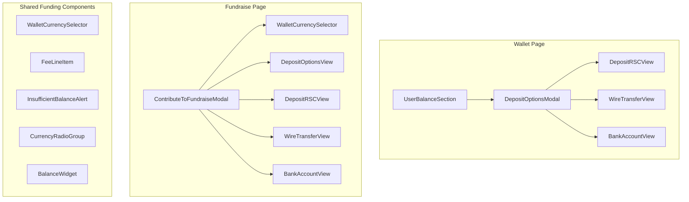
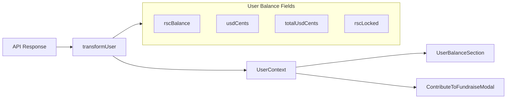
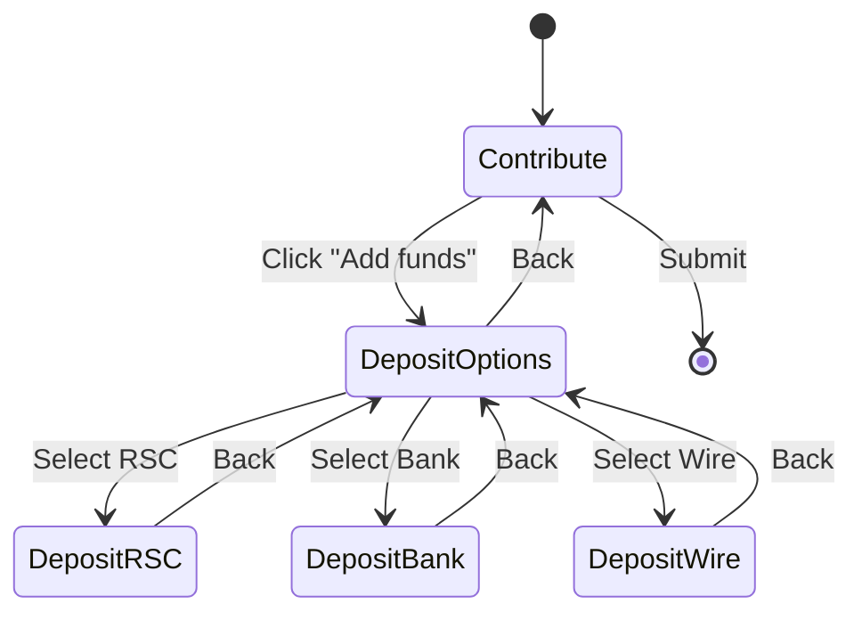
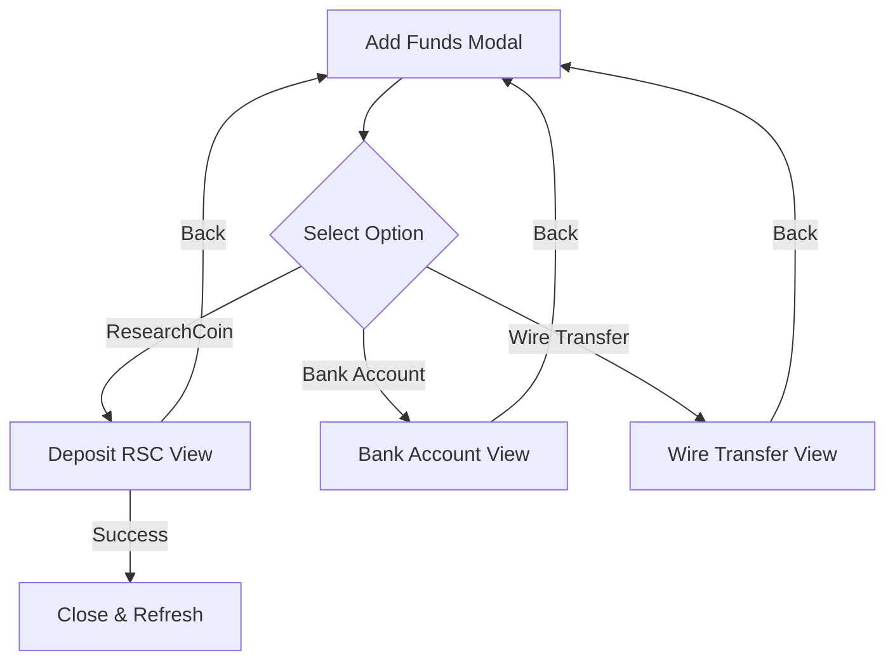
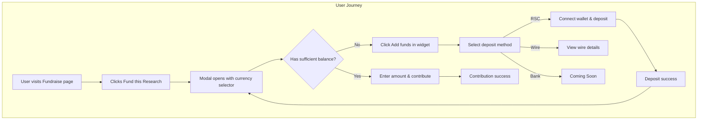

# USD/RSC Deposit Flow Implementation

This document summarizes all changes implemented to support USD and RSC deposits across the ResearchHub platform.

## Overview

The implementation introduces:
1. New user balance fields for USD/RSC tracking
2. Coinbase-style wallet balance display
3. Collapsible currency selector widget for contributions
4. Inline deposit flows within the contribution modal
5. Back button navigation in deposit modals

---

## Architecture

### Component Hierarchy



### Data Flow



---

## User Type Changes

### New Balance Fields (`types/user.ts`)

| Field | Type | Description |
|-------|------|-------------|
| `rscBalance` | `number` | Available RSC balance |
| `rscLocked` | `number` | Locked RSC (kept in data, hidden from UI) |
| `totalRsc` | `number` | Total balance in RSC equivalent |
| `usdCents` | `number` | Available USD balance in cents |
| `totalUsdCents` | `number` | Total balance in USD cents (the "whole pie") |

**Hard-coded fallback values** (until API is ready):
- `rscBalance`: 5,000 RSC
- `usdCents`: 10,000 ($100.00)
- `totalUsdCents`: 15,000 ($150.00)

---

## Wallet Page Changes

### Before vs After

```
BEFORE:                              AFTER:
┌────────────────────────┐          ┌────────────────────────┐
│ Balance Overview       │          │ $150.00                │
│ $150.00 USD           │          │ Total Balance          │
│ 5,000 RSC             │          ├────────────────────────┤
├────────────────────────┤          │ 💵 USD        $100.00  │
│ Available │ Funding   │          ├────────────────────────┤
│ Balance   │ Credits   │          │ 🔷 RSC         $50.00  │
│ $100      │ $50       │          │              5,000 RSC │
└────────────────────────┘          └────────────────────────┘
```

### Key Changes
- Total balance always shown in USD at top
- USD and RSC shown as separate rows
- RSC row shows USD value (bold) with RSC amount below (gray)
- Removed Funding Credits section
- Removed chevrons and hover effects from balance rows

---

## Contribution Modal Changes

### View State Machine



### Currency Selector Widget

```
COLLAPSED:
┌─────────────────────────────────────────┐
│ Fund with                    [🔷 RSC ▼] │
└─────────────────────────────────────────┘

EXPANDED:
┌─────────────────────────────────────────┐
│ Fund with                    [🔷 RSC ▲] │
│                                         │
│ Total Balance                           │
│ $150.00                                 │
│                                         │
│ ┌─────────────────────────────────────┐ │
│ │ 🔷 RSC    9% fee      5,000 avail ✓│ │
│ └─────────────────────────────────────┘ │
│ ┌─────────────────────────────────────┐ │
│ │ 💵 USD    12% fee     $100 avail   │ │
│ └─────────────────────────────────────┘ │
│                                         │
│ ┌ ─ ─ ─ ─ ─ ─ ─ ─ ─ ─ ─ ─ ─ ─ ─ ─ ─ ┐ │
│   ➕ Add funds                        │ │
│ └ ─ ─ ─ ─ ─ ─ ─ ─ ─ ─ ─ ─ ─ ─ ─ ─ ─ ┘ │
└─────────────────────────────────────────┘
```

### Fee Display

```
Amount: [________100________] RSC

Platform fee (9%)                  +9 RSC
─────────────────────────────────────────
Total                             109 RSC
```

---

## Deposit Options Modal Changes

### Navigation Flow



### Key Changes
- Uses inline views instead of separate modals
- Back button in header for navigation
- Consistent experience in both wallet and fundraise contexts

---

## New Components Created

### `/components/Funding/`

| Component | Purpose |
|-----------|---------|
| `WalletCurrencySelector` | Collapsible currency picker with balances |
| `CurrencyRadioGroup` | Radio-style currency selection (legacy) |
| `BalanceWidget` | Compact balance display |
| `FeeLineItem` | Fee and total display with divider |
| `InsufficientBalanceAlert` | Alert with "Add funds" action |

### `/components/modals/`

| Component | Purpose |
|-----------|---------|
| `DepositOptionsView` | Inline deposit options (non-modal) |
| `DepositRSCView` | Inline RSC deposit with wallet connection |
| `WireTransferView` | Inline wire transfer details |
| `BankAccountView` | Inline bank account (Coming Soon) |

---

## API Changes

### FundraiseService

```typescript
// Before
contributeToFundraise(fundraiseId: ID, amount: number): Promise<Fundraise>

// After
contributeToFundraise(
  fundraiseId: ID, 
  amount: number,
  currency: 'usd' | 'rsc' = 'rsc'
): Promise<Fundraise>
```

---

## Files Modified

| File | Changes |
|------|---------|
| `types/user.ts` | Added new balance fields |
| `components/ResearchCoin/UserBalanceSection.tsx` | Coinbase-style layout |
| `components/modals/ContributeToFundraiseModal.tsx` | Full restructure with inline deposit |
| `components/modals/ResearchCoin/DepositOptionsModal.tsx` | View state + back navigation |
| `services/fundraise.service.ts` | Added currency parameter |

## Files Created

| File | Purpose |
|------|---------|
| `components/Funding/WalletCurrencySelector.tsx` | Collapsible currency selector |
| `components/Funding/CurrencyRadioGroup.tsx` | Radio-style selector |
| `components/Funding/BalanceWidget.tsx` | Compact balance display |
| `components/Funding/FeeLineItem.tsx` | Fee + total display |
| `components/Funding/InsufficientBalanceAlert.tsx` | Insufficient funds alert |
| `components/Funding/index.ts` | Barrel export |
| `components/modals/DepositOptionsView.tsx` | Inline deposit options |
| `components/modals/DepositRSCView.tsx` | Inline RSC deposit |
| `components/modals/WireTransferView.tsx` | Inline wire transfer |
| `components/modals/BankAccountView.tsx` | Inline bank account |

---

## UX Flow Summary



---

## Fee Structure

| Currency | Platform Fee |
|----------|-------------|
| RSC | 9% |
| USD | 12% |

The fee badge is displayed next to each currency option in the selector, making the cost difference clear to users.
